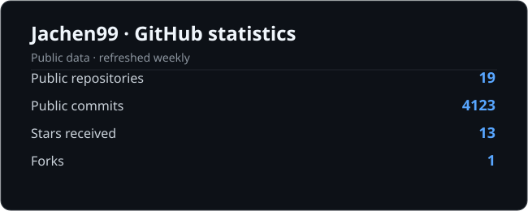
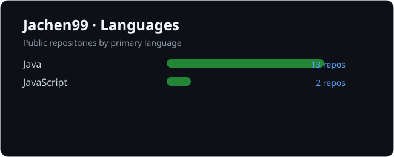

## Hi👋 I'am Jachen (软件一班季同学)
### A backend developer focusing on Java, Spring, Microservices, currently specializing in the power industry  

      

***

# 🎇My projects
| Project Name | Language | Repositories | Priority |
|:------------:|:--------:|:------------:|:--------:|
| MyBlog Built with Docusaurus | JavaScript | [MyBlog](https://github.com/Jachen99/Jachen99.github.io) | ⭐⭐⭐⭐⭐ |
| Reservation Project | Java | [yygh_parent](https://github.com/Jachen99/yygh_parent) | ⭐⭐⭐⭐ |
| Authority Project | Java | [authority](https://github.com/Jachen99/authority) | ⭐⭐⭐ |

***

  
  

